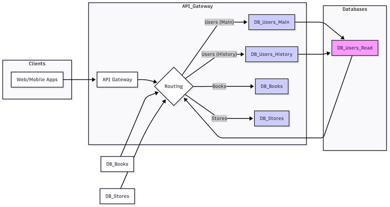

# Домашнее задание к занятию "`Репликация и масштабирование. Часть 2`" - `Лебедев Виктор`

### Инструкция по выполнению домашнего задания

   1. Сделайте `fork` данного репозитория к себе в Github и переименуйте его по названию или номеру занятия, например, https://github.com/имя-вашего-репозитория/git-hw или  https://github.com/имя-вашего-репозитория/7-1-ansible-hw).
   2. Выполните клонирование данного репозитория к себе на ПК с помощью команды `git clone`.
   3. Выполните домашнее задание и заполните у себя локально этот файл README.md:
      - впишите вверху название занятия и вашу фамилию и имя
      - в каждом задании добавьте решение в требуемом виде (текст/код/скриншоты/ссылка)
      - для корректного добавления скриншотов воспользуйтесь [инструкцией "Как вставить скриншот в шаблон с решением](https://github.com/netology-code/sys-pattern-homework/blob/main/screen-instruction.md)
      - при оформлении используйте возможности языка разметки md (коротко об этом можно посмотреть в [инструкции  по MarkDown](https://github.com/netology-code/sys-pattern-homework/blob/main/md-instruction.md))
   4. После завершения работы над домашним заданием сделайте коммит (`git commit -m "comment"`) и отправьте его на Github (`git push origin`);
   5. Для проверки домашнего задания преподавателем в личном кабинете прикрепите и отправьте ссылку на решение в виде md-файла в вашем Github.
   6. Любые вопросы по выполнению заданий спрашивайте в чате учебной группы и/или в разделе “Вопросы по заданию” в личном кабинете.
   
   Желаем успехов в выполнении домашнего задания.

---

Задание можно выполнить как в любом IDE, так и в командной строке.

### Задание 1

Опишите основные преимущества использования масштабирования методами:

- активный master-сервер и пассивный репликационный slave-сервер; 
- master-сервер и несколько slave-серверов;

*Дайте ответ в свободной форме.*

---

### Решение 1

**1. Master-Slave (активный master, пассивный slave)**

*   **Плюсы:**
    *   Простота настройки.
    *   Безопасность данных (slave как резерв).
    *   Улучшение производительности чтения (разгрузка master).
*   **Минусы:**
    *   Master - узкое место для записи.
    *   Возможна задержка репликации.

**2. Master-Slave (master + несколько slave)**

*   **Плюсы:**
    *   Улучшение производительности чтения (больше slave).
    *   Повышенная доступность (отказоустойчивость чтения).
*   **Минусы:**
    *   Усложнение конфигурации.
    *   Повышенная нагрузка на сеть (репликация).

**3. DRBD (Distributed Replicated Block Device)**

*   **Плюсы:**
    *   Высокая отказоустойчивость (быстрый failover).
    *   Репликация на уровне блоков (консистентность).
*   **Минусы:**
    *   Не масштабирует чтение (обычно один активный сервер).
    *   Требуется быстрая сеть.

**4. SAN-кластер**

*   **Плюсы:**
    *   Высокая доступность и производительность.
    *   Упрощенное обслуживание оборудования.
*   **Минусы:**
    *   Сложная и дорогая настройка.

---

### Задание 2

Разработайте план для выполнения горизонтального и вертикального шаринга базы данных. База данных состоит из трёх таблиц: 

- пользователи, 
- книги, 
- магазины (столбцы произвольно). 

Опишите принципы построения системы и их разграничение или разбивку между базами данных.

*Пришлите блоксхему, где и что будет располагаться. Опишите, в каких режимах будут работать сервера.* 

### Решение 2

**1. Вертикальный Шардинг:**

*   **Принцип:** Разделение по функциональности (таблицам).
*   **Разделение:**
    *   `DB Users`: Пользователи (id, имя, email, ...)
    *   `DB Books`: Книги (id, название, автор, ...)
    *   `DB Stores`: Магазины (id, название, адрес, ...)
*   **Преимущества:** Упрощение, оптимизация запросов, возможность использования разных СУБД.

**2. Горизонтальный Шардинг (DB Users):**

*   **Принцип:** Разделение таблицы `пользователи` по ключу (например, `id`).
*   **Разделение (пример):**
    *   `DB Users - Master 1`: Основные данные о пользователях (основные данные).
    *   `DB Users - Master 2`: История пользователя (заказы, посещения и т.д.).
    *   `DB Users - Slave 1 (Read Only)`: Реплика `Master 1` (чтение).
*   **Шардинг по `id`:**
    *   Необходимо знать `id` пользователя для определения шарда.
    *   У каждого заказа ссылка на `id` пользователя.
*   **Преимущества:** Масштабируемость, распределение нагрузки.
*   **Недостатки:** Сложность запросов, маршрутизации.

**3. Режимы Серверов:**

*   `DB Users - Master 1`: Активный (чтение/запись).
*   `DB Users - Master 2`: Активный (чтение/запись).
*   `DB Users - Slave 1`: Пассивный (чтение).

**4. Блок-схема:**

---

